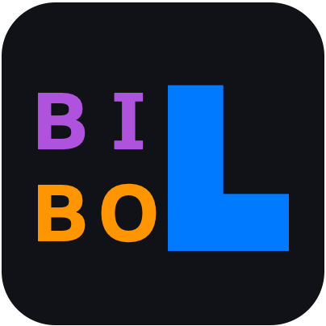

# Bilbo

BILBO hosts the documentation materials for [SAM](https://sam.amirmasoudabdol.name) simulation framework and its companion, [Frodo](https://sam.amirmasoudabdol.name/frodo/frodo.html)! It is built using [MkDocs](https://www.mkdocs.org) and it uses [Material for MkDocs](https://squidfunk.github.io/mkdocs-material/) theme. 

You can find our pre-print on [PsyArXiv](https://psyarxiv.com/zy29t).