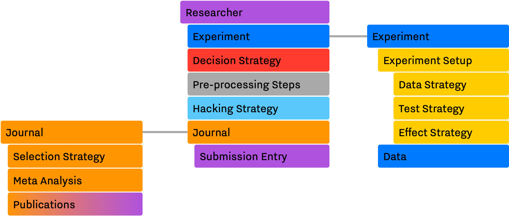
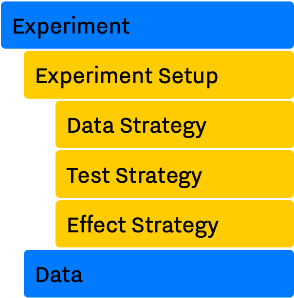
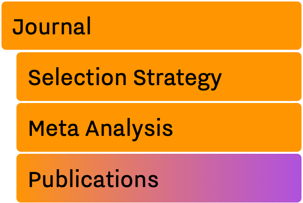
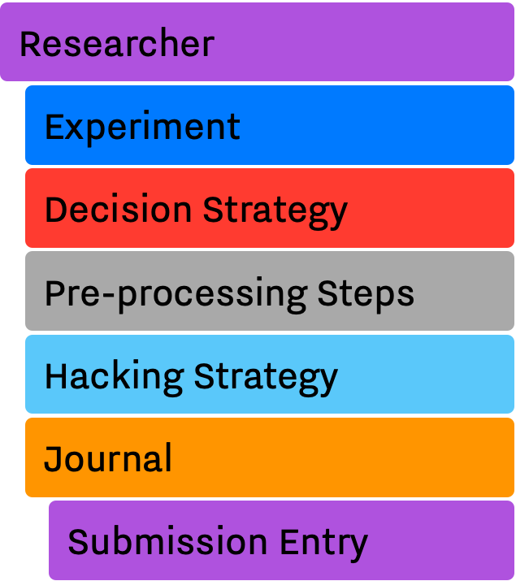

# Design

In the [previous section](introduction.md#intro-research-process), we listed some of the main components and entities involved in different stages of conducting a  research, e.g., Experiment Setup, Experiment, Researcher, Submission, and Journal. *In the abstraction*, each component is a semi-independent entity while the whole system and processes (i.e. conducting a scientific research) are defined through their interactions.

One of our main design goals with SAM was to achieve a level of flexibility where we could change different aspects of every component. In order to achieve this, we decoupled the system to smaller — but conceptually meaningful — routines and entities. Figure 1. shows these components, and their dependencies and interactions with each other.

!!! attention
		Throughout this document, we use the color assigned to each module in Figure 1. to refer to each module in different sections. 

This section will clarify the design principles behind each component, what they try to resemble in real world and how they work and interact with each others to collectively simulate as much as of the process of producing a scientific research, as possible.

## SAM's Main Components

SAM consists of 3 main components, *Experiment, Researcher* and *Journal*. Each component mimics one of the subprocesses or entities that are discussed in the [Introduction](introduction.md) section. The list below briefly introduces each component alongside their roles.

- The *[Experiment](#experiment)* comprises of several parts, each dealing with different aspects of a research, e.g., setup, data, test, effect.
    - *[Experiment Setup](#experiment-setup)* holds the specification of the design. Researcher can only set these parameters once, at the start of an experiment. In fact, the *Experiment Setup* implementation tries to mimic the concept of *pre-registration* as closed as possible.
        - *[Data Strategy](#data-strategy)* is a routine used to generate the data based on specified parameters in the *Experiment Setup*.
        - *[Test Strategy](#test-strategy)* is the statistical method of choice in the *Experiment Setup* for testing the result of an *Experiment*.
        - [*Effect Strategy*](#effect-strategy) defines the method of calculating effect sizes in an *Experiment*.
- The *[Researcher](#researcher)* module imitates the behaviors of a researcher, including possible questionable research practices conducted by him/her. The researcher will define the experiment setup, generate and collect the data, run the statistical test, decides whether to preform any QRPs, prepare the *Submission* record, and finally submit its finding(s) to the *Journal* of her/his choice.
    - *[Decision Strategy](#decision-strategy)* is the underling logic and steps of performing the research, as well as selecting and reporting a specific variables as the primary outcome in an *Experiment*.
    - *[Hacking Strategy](#hacking-startegies)* is a list of questionable research practices in researcher's arsenal. In the case where the researcher decides to hack his/her way through finding significant results, he/she can use these methods.
- The [*Journal*](#journal) is a container of publications, i.e., published *submission*. The Journal keeps track of its publications and can utilize different metrics to adapts its selection strategy.
    - *[Selection Strategy](#selection-strategy)* is the internal algorithm by which the journal decides whether a submission will be accepted, or not.
    - *[Submission](#submission)* is a concise report, acting as a *scientific paper*, or *a manuscript* that it is going to be submitted for review to the Journal.

!!! note

    Unlike a real scientific journal that covers a wide range of research tracks, SAM's Journal in its current implementation assumes that all submitted publications are from one research track. In other words, SAM's journals are mainly acting as a pool for related studies ready to be analyzed using meta-analyses methods.

!!! note

    SAM uses several object-oriented principles and design patterns to achieve the level of flexibility that is offering. Since all SAM components' are technically C++ classes, we may refer to them as objects, e.g., Experiment object, and they will appear in `monospace` font.
    
While the rest of this section discuss each component properties and rule in more details, more information about each component can be found in their dedicated pages.

### Experiment

<picture>
  
</picture>

As mentioned, an `Experiment` object acts as an umbrella for everything related to an actual experiment. This includes metadata (a.k.a `ExperimentSetup`), raw data, method/model for generating the data, e.g., [Linear Model](data-strategies.md#linear-model), and methods of testing the hypothesis, and calculating the effect. The `Researcher` object has the complete control over every aspects of an `Experiment` **with one exception**: it can only read and not change the `ExperimentSetup` object. This is an important factor when later on we discuss the concept of pre-registration.

Main components of `Experiment` are:

- Experiment Setup
- Data, an object containing actual data points

#### Experiment Setup

After the initialization phase, SAM treats the `ExperimentSetup` object as a read-only object. During the initialization phase, SAM initializes and randomizes the `ExperimentSetup` based on given parameters. Thereafter, `ExperimentSetup` will stay intact in the code and will be used as a reference point in different stages. 

Main components of experiment setup are:

- Design Parameters
	- Number of conditions
	- Number of dependent variables
	- Number of observations per group
- Data Strategy
- Test Strategy
- Effect Strategy

##### Data Strategy

`DataStrategy` acts as the population of the study, i.e., *data source*. In most cases, an instance of `DataStrategy` object uses a statistical model to sample data points and populates the `Data` object of the `Experiment`. 

Moreover, with certain *p*-hacking methods, e.g., [optional stopping](/hacking-strategies/optional-stopping), the data strategy will be used to generate *extra* data points as requested by the optional stopping.

Available data strategies are:

- Linear Model
- Graded Response Model
- Latent Model (under development)

##### Test Strategy

`TestStrategy` provides a routine for testing the hypothesis. TestStrategy can access the entire `Experiment` object but often it is restricted to only modifying relevant variables, e.g., `pvalue, statistics, sig`.

There are several test strategies already implemented:

- T-Test
- F-Test
- Yuen T-Test
- Wilcoxon Test

##### Effect Strategy

`EffectStrategy` defines a method of calculating the magnitude of effect between two experimental groups.

List of available effect strategies:

- Mean Difference
- Cohen's D
- Hedge's G
- Odd Ratio

### Journal

<picture>
  
</picture>

In SAM, a `Journal` is often a container for *accepted* publications. `Journal` is designed to mimic the reviewing process. Therefore, it can use any arbitrary algorithms for deciding whether a submission will be accepted or not.

Journal's components are:

- Selection Strategy
- Accepted List, ie., Publications List
- Rejected List
- Meta-analytic Methods
	- Meta-analytic Results

#### Selection Strategy

`Selection Strategy` implements the logic behind accepting or rejecting a submission. The simplest algorithms are mainly working with *p*-values and based their decision on a simple threshold check. However, more elaborate selection strategies can incorporate different metrics or criteria (e.g., pre-registration, sample sizes, or meta-analysis) into their final decision. For instance, if appropriate, a journal can have an updated estimation of the effect size from its current publications pool and use that information to accept or reject submissions.

List of available selection strategies are:

- Significant Selection
- Random Selection
- Free Selection

#### Submission

A `Submission` is a small container, created by the `Researcher` and provided to the `Journal`. It provides a simple interface between `Journal, Experiment` and `Researcher` objects. In fact, a `Submission` resembles a *manuscript* when it is at the hand of the researcher and a *publication* after being accepted by the journal. 

After performing the test and choosing the outcome variable, the `Researcher` puts together a report containing necessary information for the `Journal` to decide whether to accept or reject the submitted finding(s). This representation will allow us to mimic several important concepts when it comes to publication habits, e.g., file-drawer effect, pre-registration, etc. 

!!! note

    `Submission` is an abstract representation of the manuscript and it does not try to closely resembles a full publication.

### Researcher

<!-- {: align=right} -->

<picture>
  
</picture>

`Researcher` object is the main player in the simulation. It's a central piece of the research, it uses the `ExperimentSetup` to prepare the `Experiment` and send the final outcome to the `Journal` for reviewing process.

After the initialization of the `ExperimentSetup`, `Researcher` will prepare the `Experiment` object by collecting data through the data strategy, testing the hypothesis via the test strategy, and calculating the effect sizes using the effect strategy. Then, if programmed to, it applies different *p*-hacking methods on the dataset and hacks its way through a significant result. In the end, the researcher prepares a `Submission` record and send it to the `Journal` for review. This process is discussed in more detailed in `flow`{.interpreted-text role="doc"} chapter.

Below is a list of main methods and variables of `Researcher`.

- `experiment`, an instance of `design-experiment`{.interpreted-text role="ref"}
- `journal`, an instance of `design-journal`{.interpreted-text role="ref"}
- `decisionStrategy`, an instance of `design-decision-strategy`{.interpreted-text role="ref"}.
- *isHacker*, a flag indicating whether the researcher will perform any p-hacking methods on the data
- `hackingStrategies`, a list of `hacking-strategies`{.interpreted-text role="doc"}.
- `prepareResearch()`, a method to initialize the experiment
- `performResearch()`, a method to calculate the necessary statistics, running the tests, and applying p-hacking methods (if applicable).
- `publishResearch()`, a method to prepare the final `submission`{.interpreted-text role="ref"} and submit it to the `journal`{.interpreted-text role="ref"} for review.

#### Decision Strategy

As the name suggests, `DecisionStrategy` describes how the `Researcher` chooses between different outcome variables during the research. The list below shows a few available options. The default is always `PreRegisteredOutcome` which means the `Researcher` always selects the pre-registered outcome regardless of its significance.

- `PreRegisteredOutcome`
- `MinPvalue`
- `MaxEffect`
- `MaxEffectMinPvalue`

`Researcher` can consult his *Decision Strategy* in different stages of the research. **1)** Just before applying any hacking strategies, a researcher can check if the pre-registered outcome is significant or not, *initial verdict*. **2)** If it is not, during the execution of a hacking strategy, it can ask the decision strategy whether to interrupt the hacking process, *intermediate verdict*. **3)** After the completion of a hacking routine, the decision strategy evaluates the outcome, *hacking verdict*. **4)** Finally, in his *final verdict*, a researcher can look back at the history of his `Experiment` and pick the final result that is going to be submitted in the form of `Submission`.

Main variables and methods of `DecisionStrategy` are:

- *isStillHacking*, a flag indicating whether the `Researcher` should continue with the hacking procedure, or the result is already satisfactory
- `isPublishable()`, a method indicating if the selected outcome is significant or not
- `submissionsPool`, a history of all `Submission` records during the research
- `experimentsPool`, a history of all modified versions of `Experiment` during the research.
- `verdict(Experiment, DecisionStage)` .. - `finalSubmission`, .. 
- `more … <exhale_class_class_experiment_setup>`{.interpreted-text role="ref"}

!!! attention

    The decision strategy is one of the more complicated pieces of SAM. It engages in different stages of conducting the research by researcher and different hacking strategies. This process will be clarified in [Flow](flow.md) and *‌[Decision Strategy](decision-strategies.md)* chapters.

#### Hacking Strategy-(ies)

`Hacking Strategy` is an abstract representation of different *p*-hacking and QRP methods. The `Researcher` *performs* a hacking strategy by sending a copy of its `Experiment` to chosen method. The `Hacking Strategy` takes control of the experiment, modifies it, (e.g., adding new values, removing values), recomputes the statistics, reruns the test, and finally returns the modified `Experiment`. Finally, the researcher can evaluate the *hacked* experiment, and select *hacked* result if satisfactory.

If more than one hacking strategies are registered, researcher navigates through them by the logic defined in Decision Strategy and decides whether any of the *hacked* experiments will be used for constructing the *Submission*. This process will be discussed in more details, in *[Decision Strategy](decision-strategy.md)* and *[Hacking Strategy](hacking-strategy.md)* sections.

List of available hacking strategies are:

- Optional Stopping
- Outliers Removal
- Subjective Outliers Removal
- Questionable Rounding
- Falsifying Data
- Fabricating Data
- Stopping Data Collection